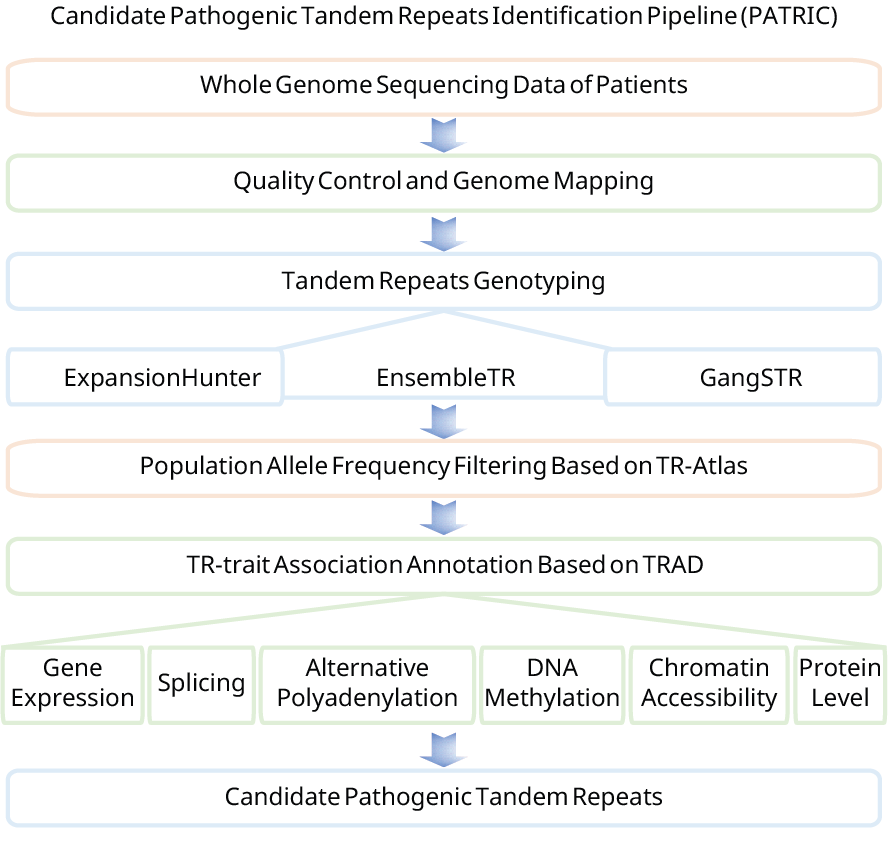

# PATRIC: candidate pathogenic TRs identification pipeline


## 1.Data Preprocessing

Using SOAPnuke as an example, execute the following program to preprocess the data.
```bash 
Data_Preprocessing.sh -name Sample_Name
```


## 2.TR Genotyping

GangSTR and ExpansionHunter were applied to genotype TRs in parallel. After conducting independent quality control on the outputs from each tool, the results were integrated using ensembleTR. Execute the following program to perform TR genotyping.
```bash
TR_Genotyping.sh -name Sample_Name -sex Sample_Sex
```


## 3.TR Allele Frequency Filtering

Based on the TR allele frequency data from TR-Atlas, execute the following program to perform TR allele frequency fitering. Regarding the acquisition of TR allele frequency data, please reach out to the authors of the [TR-Atlas](https://wlcb.oit.uci.edu/TRatlas/).

```python
python TR_AF_Filtering.py --file1 TR_AlleleFreq.txt --file2 Sample_Name_ensembletr.vcf --output Sample_Name_ensembletr_AF.vcf
bcftools view Sample_Name_ensembletr_AF.vcf -Oz -o Sample_Name_ensembletr_AF.vcf.gz
bcftools index -t Sample_Name_ensembletr_AF.vcf.gz
```

## 4.TR Functional Annotation

Merge VCF files of samples in the same pedigree into one VCF file, remove lines with GT="./."

```bash
bcftools merge -o Pedigree_No_orig.vcf.gz Sample_Name1_ensembletr_AF.vcf.gz Sample_Name2_ensembletr_AF.vcf.gz
bcftools view -i 'COUNT(GT="./.") == 0' Pedigree_No_orig.vcf.gz -o Pedigree_No.vcf.gz
```


Find TRs that have been annotated in TRAD, TRAD_anno.txt was obtained from [TRAD database](http://trad.zryhyy.com.cn/)
```python
python TRAD_anno.py Pedigree_No.vcf.gz TRAD_anno.txt Pedigree_No_TRAD.txt
```

Extract key columns from annotation results
```python
python Extract_TRAD_anno.py Pedigree_No Pedigree_No_TRAD.txt Pedigree_No_TRAD_extracted.txt
```

Filtering extracted TRAD annotation. Only retain TRs that have the same rare allele (frequency ≤ 0.005) present in all pedigree members.
```python
python Filtering_extracted_TRAD_anno.py Pedigree_No_TRAD_extracted.txt Pedigree_No_TRAD_extracted_filtered.txt Pedigree_No_TRAD_extracted_filtered.xlsx
```
